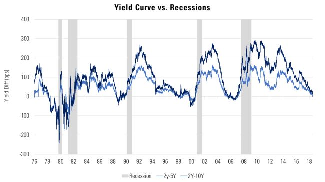
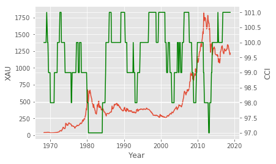
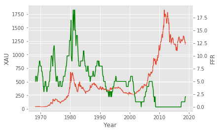
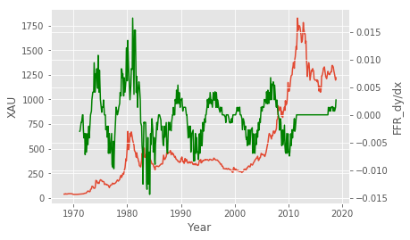
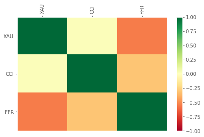
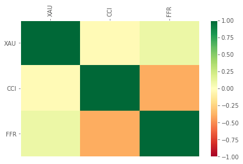
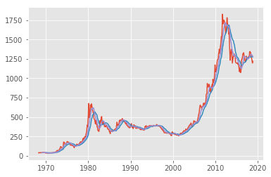
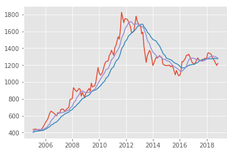

## <center> Exploring the Association Between the price of Gold and Indicators of a Recession </center>

One of the most accurate indicators of a recession is the yield curve. The yield curve is the difference in basis points between the yield of a 10-year treasury note and the yield of a 2-year treasury note. From the image below, we can see that every time the curve has gone negative, the U.S. has entered into a recession soon after. The spread between the 2- and 5-year yields has already gone negative, and it looks like the 2- and 10-year yields could follow.


```python
from IPython.display import Image

fig = Image(filename=('data/yield_curve.png'))
fig
```





The chart above is shown to confirm my suspision of an impending recession. The rest of the notebook will look at other indicators that could predict the price of gold.


```python
import pandas as pd
import numpy as np
import matplotlib.pyplot as plt
from matplotlib import style
from datetime import datetime
import pandas_datareader.data as web
import datetime as dt
```

Below, three csv files are read in to dataframes so that they can be cleaned and merged into one. Data includes:
* Price of gold 
* Consumer confidence index
* Federal funds rate

From this data, four new columns are created:
* Two-week moving average of gold(MA_14), and a one-week moving average of gold(MA_7). These two are used in conjunction to create a moving average crossover, which is commonly used as an indicator in algorithms. 
* A two-month moving average of the federal funds rate(MA_FFR).
* The derivative of the federal funds rate moving average(FFR_dy/dx). This will also be used as an indicator.


```python
def preprocess_data():
   
    #fixed daily price of gold for the last 50 years
    #Source: ICE Benchmark Administration Limited (IBA), Gold Fixing Price 10:30 A.M. (London time) in London Bullion Market, based in U.S. Dollars [GOLDAMGBD228NLBM], retrieved from FRED, Federal Reserve Bank of St. Louis; https://fred.stlouisfed.org/series/GOLDAMGBD228NLBM, December 30, 2018.
    df_xau = pd.read_csv('data/GoldPrice.csv', index_col='DATE', parse_dates=True)
    #consumer confidence index
    #Source: Main Economic Indicators: Business tendency and consumer opinion surveys 
    df_cci = pd.read_csv('data/CCI.csv', index_col='TIME', parse_dates=True)
    #federal funds rate
    #Source: Board of Governors of the Federal Reserve System (US), Effective Federal Funds Rate [FEDFUNDS], retrieved from FRED, Federal Reserve Bank of St. Louis; https://fred.stlouisfed.org/series/FEDFUNDS, January 2, 2019
    df_ffr = pd.read_csv('data/FFR.csv', index_col='DATE', parse_dates=True)
    
    #clean data
    
    #clean XAU data
    df_xau['PRICE'].replace('.', 'NaN', inplace=True)
    df_xau['PRICE'] = df_xau[df_xau['PRICE'].apply(lambda x: x.isdecimal())]
    df_xau['PRICE'].fillna(method='ffill', inplace=True)
    df_xau['PRICE'] = df_xau['PRICE'].astype(int)
    
    #make values integers
    df_cci['Value'] = df_cci['Value'].astype(int)
    df_ffr['FEDFUNDS'] = df_ffr['FEDFUNDS'].astype(int)

    #merge dataframes with index that has values for all three columns (resample data to monthly)
    df = pd.merge(df_xau, df_cci['Value'].to_frame(), left_index=True, right_index=True, how='inner')
    df = df.merge(df_ffr['FEDFUNDS'].to_frame(), left_index=True, right_index =True, how='inner') 
    df.rename(index=str, columns={'PRICE' : 'XAU' , 'Value' : 'CCI', 'FEDFUNDS' : 'FFR'}, inplace=True)

    #fix formatting
    df.index = df.index.str.replace(' 00:00:00', '')
    df.index = pd.to_datetime(df.index, infer_datetime_format=True)
    df = df[~df.index.duplicated(keep='first')]
    df = df.groupby(level=0).first() 
    df.index.name = 'DATE'
    
    #create moving averages for gold
    df['MA14'] = df['XAU'].rolling(window=14).mean()
    df['MA7'] = df['XAU'].rolling(window=7).mean()
    
    #2 year moving average 
    df['MA_FFR'] = df['FFR'].rolling(window=12*2).mean()
    
    #derivative of moving average
    dy = df['MA_FFR'].diff()
    dx = df.index.to_series().diff().dt.total_seconds()/86400
    df['FFR_dy/dx'] = dy/dx
    
    return df
```


```python
df = preprocess_data()
print(df)
```

                 XAU  CCI  FFR         MA14          MA7    MA_FFR  FFR_dy/dx
    DATE                                                                     
    1968-04-01    38  100    5          NaN          NaN       NaN        NaN
    1968-05-01    38  100    6          NaN          NaN       NaN        NaN
    1968-07-01    42  100    6          NaN          NaN       NaN        NaN
    1968-08-01    38  100    6          NaN          NaN       NaN        NaN
    1968-10-01    40  100    5          NaN          NaN       NaN        NaN
    1968-11-01    39  100    5          NaN          NaN       NaN        NaN
    1969-01-01    42  101    6          NaN    39.571429       NaN        NaN
    1969-04-01    43  100    7          NaN    40.285714       NaN        NaN
    1969-05-01    43  100    8          NaN    41.000000       NaN        NaN
    1969-07-01    43   99    8          NaN    41.142857       NaN        NaN
    1969-08-01    42   99    9          NaN    41.714286       NaN        NaN
    1969-09-01    41   99    9          NaN    41.857143       NaN        NaN
    1969-10-01    41   99    9          NaN    42.142857       NaN        NaN
    1969-12-01    36   99    8    40.428571    41.285714       NaN        NaN
    1970-01-01    35   98    8    40.214286    40.142857       NaN        NaN
    1970-04-01    35   98    8    40.000000    39.000000       NaN        NaN
    1970-05-01    35   98    7    39.500000    37.857143       NaN        NaN
    1970-06-01    36   98    7    39.357143    37.000000       NaN        NaN
    1970-07-01    36   98    7    39.071429    36.285714       NaN        NaN
    1970-09-01    36   98    6    38.857143    35.571429       NaN        NaN
    1970-10-01    36   98    6    38.428571    35.571429       NaN        NaN
    1970-12-01    37   98    4    38.000000    35.857143       NaN        NaN
    1971-01-01    37   98    4    37.571429    36.142857       NaN        NaN
    1971-02-01    38   99    3    37.214286    36.571429  6.541667        NaN
    1971-03-01    38   99    3    36.928571    36.857143  6.458333  -0.002976
    1971-04-01    38   99    4    36.714286    37.142857  6.375000  -0.002688
    1971-06-01    40   99    4    36.642857    37.714286  6.291667  -0.001366
    1971-07-01    40   99    5    36.928571    38.285714  6.250000  -0.001389
    1971-09-01    41   99    5    37.357143    38.857143  6.250000   0.000000
    1971-10-01    41   99    5    37.785714    39.428571  6.250000   0.000000
    ...          ...  ...  ...          ...          ...       ...        ...
    2015-07-01  1175  101    0  1240.357143  1192.285714  0.000000   0.000000
    2015-09-01  1085  100    0  1221.357143  1174.428571  0.000000   0.000000
    2015-10-01  1136  100    0  1217.142857  1165.857143  0.000000   0.000000
    2015-12-01  1073  100    0  1201.357143  1148.571429  0.000000   0.000000
    2016-01-01  1077  100    0  1186.642857  1131.285714  0.000000   0.000000
    2016-02-01  1122  100    0  1173.000000  1123.142857  0.000000   0.000000
    2016-03-01  1240  100    0  1169.071429  1129.714286  0.000000   0.000000
    2016-04-01  1240  100    0  1165.642857  1139.000000  0.000000   0.000000
    2016-06-01  1281  100    0  1170.714286  1167.000000  0.000000   0.000000
    2016-07-01  1317  100    0  1179.357143  1192.857143  0.000000   0.000000
    2016-08-01  1315  100    0  1188.000000  1227.428571  0.000000   0.000000
    2016-09-01  1330  100    0  1197.428571  1263.571429  0.000000   0.000000
    2016-11-01  1267  101    0  1203.714286  1284.285714  0.000000   0.000000
    2016-12-01  1232  101    0  1206.428571  1283.142857  0.000000   0.000000
    2017-02-01  1210  101    0  1208.928571  1278.857143  0.000000   0.000000
    2017-03-01  1231  101    0  1219.357143  1271.714286  0.000000   0.000000
    2017-05-01  1285  101    0  1230.000000  1267.142857  0.000000   0.000000
    2017-06-01  1265  101    1  1243.714286  1260.000000  0.041667   0.001344
    2017-08-01  1252  101    1  1256.214286  1248.857143  0.083333   0.000683
    2017-09-01  1252  101    1  1265.500000  1246.714286  0.125000   0.001344
    2017-11-01  1278  101    1  1268.214286  1253.285714  0.166667   0.000683
    2017-12-01  1280  101    1  1271.071429  1263.285714  0.208333   0.001389
    2018-01-01  1280  101    1  1271.000000  1270.285714  0.250000   0.001344
    2018-02-01  1343  101    1  1272.857143  1278.571429  0.291667   0.001344
    2018-03-01  1345  101    1  1275.000000  1290.000000  0.333333   0.001488
    2018-05-01  1328  101    1  1274.857143  1300.857143  0.375000   0.000683
    2018-06-01  1294  101    1  1276.785714  1306.857143  0.416667   0.001344
    2018-08-01  1250  101    1  1278.071429  1302.857143  0.458333   0.000683
    2018-10-01  1196  101    2  1277.071429  1290.857143  0.541667   0.001366
    2018-11-01  1220  101    2  1276.285714  1282.285714  0.625000   0.002688
    
    [433 rows x 7 columns]


```python
#export to csv so it can be imported into the algorithm file
df.to_csv('data/indicators.csv')
```

The function below can be used to graph two different lines on the same chart 


```python
def graph_data(val1,val2): 
    style.use('ggplot')
    fig, ax1 = plt.subplots()
    ax1.plot(val1.index, val1)
    #ax1.plot(a.index, b)
    ax2 = ax1.twinx()
    ax2.plot(val2, c='g')
    ax1.set_xlabel('Year')
    ax1.set_ylabel(val1.name)
    ax2.set_ylabel(val2.name)
```

First, we can look at the association between the price of gold and the consumer confidence index


```python
graph_data(df['XAU'], df['CCI'])
```





It looks like there is an association between the two, but only when the price of gold is more volatile. This is good for visualizing the interaction between the economy and the price of gold, but it doesn't look like it has much predictive power. This makes sense because the consumer confidence index tends to react to economic conditions, not cause them.

Next we can look at the price of gold and the federal funds rate.


```python
graph_data(df['XAU'], df['FFR'])
```





From this graph we can see that sharp changes in the federal funds rate happen slightly before the price of gold goes up. Gold seems to lag behind the federal funds rate, which indicates that it could have some predictive power. 

Below is the derivative of the federal funds rate and the price of gold.


```python
graph_data(df['XAU'], df['FFR_dy/dx'])
```





This doesn't tell us much more than the FFR does, but it visualizes what values will be used in the algorithm.

The function below is used to create an association table.


```python
def association_table(columns):
    #association before 2008
    df_corr = columns.corr()
    print(df_corr.head())

    data = df_corr.values
    fig = plt.figure()
    ax = fig.add_subplot(1,1,1)

    heatmap = ax.pcolor(data, cmap=plt.cm.RdYlGn)
    fig.colorbar(heatmap)
    ax.set_xticks(np.arange(data.shape[0]) + 0.5, minor=False)
    ax.set_yticks(np.arange(data.shape[1]) + 0.5, minor=False)
    ax.invert_yaxis()
    ax.xaxis.tick_top()

    column_labels = df_corr.columns
    row_labels = df_corr.index

    ax.set_xticklabels(column_labels)
    ax.set_yticklabels(row_labels)
    plt.xticks(rotation=90)
    heatmap.set_clim(-1,1)
    plt.tight_layout()
    plt.show()
```


```python
association_table(df[['XAU', 'CCI', 'FFR']])
```

              XAU       CCI       FFR
    XAU  1.000000  0.016759 -0.549254
    CCI  0.016759  1.000000 -0.308627
    FFR -0.549254 -0.308627  1.000000





From this we can see a slightly negative correlation between CCI and FFR. This makes sense since low interest rates encourage economic growth and higher consumer confidence. Since the fed reduced rates to 0 after the 2008 crash, it appears to be negatively correlated with gold. Let's take a look at the association before 2008.


```python
association_table(df[['XAU', 'CCI', 'FFR']][:'2008-01-01'])
```

              XAU       CCI       FFR
    XAU  1.000000 -0.031665  0.095407
    CCI -0.031665  1.000000 -0.403146
    FFR  0.095407 -0.403146  1.000000





This shows the relationship a bit better. Since some indicators lead and others follow, the association with respect to the same index doesn't show much of an association.

Lastly, a function to graph the moving averages of gold is created.


```python
#moving avg crossover 
def moving_avg(a,b,c):
    style.use('ggplot')
    fig, ax1 = plt.subplots()
    ax1.plot(a.index, a)
    ax1.plot(b.index, b)
    ax1.plot(a.index, c)

```


```python
moving_avg(df['XAU'], df['MA14'], df['MA7'])
```





Since the algorithm will only be trading on data after 2004, it will be better to look at that timeframe.


```python
moving_avg(df['XAU']['2005-01-01':], df['MA14']['2005-01-01':], df['MA7']['2005-01-01':])
```





From this graph, we can see that when the purple line(one week MA) is above the blue(two week MA), we should buy. When the two crossover, we should sell.

With this information, we can move on to creating an algorithm.
